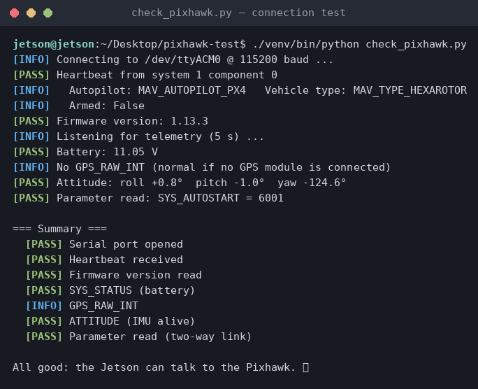
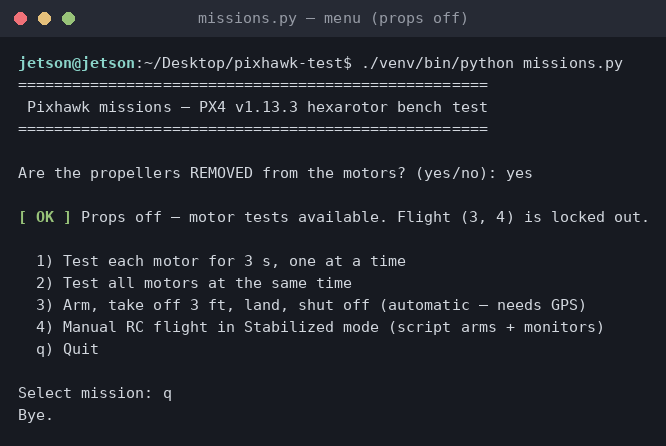
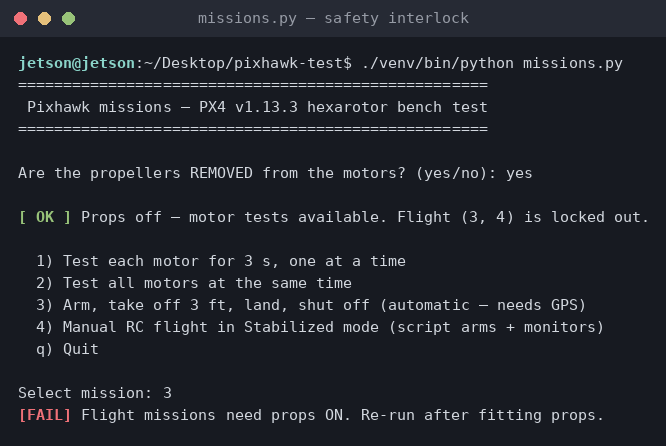
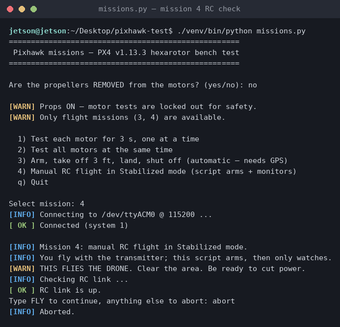

# Pixhawk ↔ Jetson Connection Test

Minimal, no-GUI test of the MAVLink link between the companion computer and the
flight controller. No QGroundControl or IDE required — just Python and a USB cable.

## Current hardware setup

| Component | Details |
|---|---|
| Companion computer | NVIDIA Jetson Orin Nano Developer Kit |
| OS | Ubuntu 24.04.4 LTS (L4T R39.2, kernel 6.8 tegra) |
| Flight controller | Pixhawk 2.4.8 (FMUv2, shows as `26ac:0011 3D Robotics PX4 FMU v2.x`) |
| Firmware | PX4 v1.13.3 |
| Connection | USB → `/dev/ttyACM0` (baud rate is ignored on USB CDC) |
| Ground station | None installed (this repo replaces QGC for basic checks) |

Other serial ports available on the Jetson if you later wire TELEM2 to the
40-pin header: `/dev/ttyTHS1` and `/dev/ttyTHS2` (UARTs, typically 57600 or
921600 baud — must match the `SER_TEL2_BAUD` PX4 parameter).

## First-time setup

```bash
bash setup.sh
```

This does three things (asks for your sudo password once):

1. Adds your user to the `dialout` group — required to open `/dev/ttyACM0`.
   Permanent after the next logout/login or reboot.
2. Grants immediate access to the port so you can test right away.
3. Creates a `venv/` virtual environment and installs `pymavlink`
   (Ubuntu 24.04 blocks system-wide `pip install`, hence the venv).

## Running the test

```bash
./venv/bin/python check_pixhawk.py
```

or, with the venv activated (`source venv/bin/activate`):

```bash
python check_pixhawk.py
```

Options:

```bash
python check_pixhawk.py --device /dev/ttyTHS1 --baud 921600   # via TELEM2 UART
python check_pixhawk.py --timeout 20                          # slower heartbeat wait
```



## What the script checks

1. **Serial port opens** — cable present, permissions OK.
2. **Heartbeat** — the autopilot is alive and speaking MAVLink; prints
   system/component ID, autopilot type, vehicle type, armed state.
3. **Firmware version** — requests `AUTOPILOT_VERSION` (should report 1.13.3).
4. **Telemetry** — battery voltage (`SYS_STATUS`), GPS fix and satellite count
   (`GPS_RAW_INT`, skipped gracefully if no GPS module), attitude from the IMU
   (`ATTITUDE`).
5. **Parameter read** — reads `SYS_AUTOSTART` to prove two-way communication.

Exit code is `0` when everything passes, `1` otherwise — safe to use in scripts.

Expected output on a healthy USB-powered bench setup:

```
[PASS] Heartbeat from system 1 component 1
[INFO]   Autopilot: MAV_AUTOPILOT_PX4   Vehicle type: MAV_TYPE_QUADROTOR
[PASS] Firmware version: 1.13.3
[PASS] Battery: 0.00 V  (no battery / USB power only)
...
All good: the Jetson can talk to the Pixhawk. ✅
```

## Troubleshooting

- **`Permission denied` on `/dev/ttyACM0`** — log out/in (or reboot) so the
  `dialout` group takes effect, or re-run `setup.sh`.
- **Device missing** — check `ls /dev/ttyACM*` and `lsusb | grep 26ac`.
  Try a different USB cable (data lines required, not charge-only).
- **No heartbeat** — wait ~30 s after plugging in for PX4 to boot; make sure
  nothing else (e.g. MAVProxy) already has the port open.

## Missions (missions.py)

Interactive bench-test program:

```bash
./venv/bin/python missions.py
```

It first asks whether the propellers are removed, then offers:

| Mission | What it does | Requires |
|---|---|---|
| 1 | Spins each motor one at a time, 3 s each at 15% throttle | Props **OFF** |
| 2 | Spins all motors together for 3 s at 15% throttle | Props **OFF** |
| 3 | Arms, takes off to 3 ft (0.91 m), hovers, lands, disarms | Props **ON**, GPS position fix, extra `FLY` confirmation |
| 4 | Manual RC flight: switches to Stabilized, arms, then monitors while you fly with the transmitter | Props **ON**, RC link up, extra `FLY` confirmation |
| 5 | Camera tracking display — shows the OAK-D's live person X/Y/Z. No flight. | `oak-camera` service running |
| 6 | LoRa remote — runs missions from LoRa commands (see table below) | LoRa module on `/dev/ttyUSB0` |

Safety interlocks: motor tests are locked out while props are on, and flight is
locked out while props are off. Ctrl-C sends a disarm in missions 1–3; in
mission 4 it only stops the monitor — the RC pilot keeps control and disarms
with the sticks (throttle low + yaw left).

### Camera + LoRa architecture

Two processes talk over a local UDP socket, which keeps the camera's DepthAI
environment separate from the flight code's venv:

```
OAK-D  --USB-->  camera_publisher.py (depthai-env)  --UDP 127.0.0.1:5005-->  missions.py (venv)
LoRa   --/dev/ttyUSB0 serial-->                                              missions.py (pyserial)
Pixhawk--/dev/ttyACM0 MAVLink-->                                             missions.py (pymavlink)
```

- **`camera_publisher.py`** runs the OAK-D person detector headlessly (in
  `~/oak_drone_project/depthai-env`) and broadcasts the nearest person's
  `{x, y, z, conf}` in metres. Started automatically on boot by `oak-camera.service`.
- **Option 5** subscribes to that UDP stream and prints live coordinates — pure
  telemetry, never touches the flight controller. (Autonomous *follow-flight* is
  intentionally not wired up on this PX4 vehicle yet; see Notes.)
- **Option 6** turns LoRa packets (`{"msg": "N"}`) into missions, under the **same
  props interlock** you declare at startup:

  | LoRa `msg` | Action | Allowed when |
  |---|---|---|
  | `1` | sequential motor test | props **OFF** |
  | `2` | all-motor test | props **OFF** |
  | `3` | camera display (30 s) | always |
  | `4` | flight: arm / takeoff / land | props **ON** |

  Because a LoRa sender can't type the `FLY` prompt, command `4` flies with **no
  local confirmation** — it is still gated by props-ON and the Pixhawk's own
  pre-arm checks (which currently need a GPS fix). LoRa is **not** auto-started on
  boot; it only runs after you pick option 6.

The mission menu with props off, and the interlock refusing a flight mission
without props:




Mission 4 verifying the RC link before flight (aborted at the FLY prompt):



Notes for this vehicle (PX4 v1.13.3, FMUv2):

- Motor tests use `MAV_CMD_DO_MOTOR_TEST`; the safety switch must be pressed
  (solid LED) and a battery connected, or the FC rejects the command.
- Mission 3 uses PX4's AUTO.TAKEOFF/AUTO.LAND modes. PX4's own preflight and
  arm-time checks must pass before it will arm; when it refuses, the script
  prints the FC's exact reason ("FC says: ...").
- This vehicle is configured as airframe `SYS_AUTOSTART=6001` (DJI F550
  hexarotor), safety switch bypassed (`CBRK_IO_SAFETY=22027`), arming without
  GPS allowed (`COM_ARM_WO_GPS=1`).
- FMUv2 quirk: PX4 v1.13 on this board doesn't run `load_mon`, so the
  "No CPU load information" preflight check fails out of the box. We set
  `COM_CPU_MAX=-1` to disable that check.

## Install: desktop icon + camera-on-boot

```bash
bash install.sh
```

This (asks for your sudo password once):

1. Puts a **Hexacopter Mission** icon on the Desktop. Double-clicking it opens a
   terminal running the mission menu (`run_missions.sh` → `missions.py`).
2. Installs and enables **`oak-camera.service`**, which starts `camera_publisher.py`
   on every boot so person coordinates are always flowing on UDP 5005.

Check / control the camera service:

```bash
systemctl status oak-camera        # is it running?
journalctl -u oak-camera -f        # live camera log
sudo systemctl restart oak-camera  # restart it
```

The camera service is **camera only** — it never arms or flies the drone. Flight
happens solely through the mission menu (or a deliberate LoRa command).

## Follow-me code from classmates (`hexacopter-follow/`)

The `hexacopter-follow/` folder is a separate project (a classmate's git repo) built
for the **ArduPilot SITL simulator**, not this PX4 vehicle — its GUIDED-mode flight
paths do not run on PX4 as-is. It is kept on disk but git-ignored by this repo. The
only piece reused here is the camera → UDP idea, reimplemented safely in
`camera_publisher.py`. Porting its autonomous person-following to PX4 (OFFBOARD mode
+ geofence/failsafe hardening) is future work.

## Next steps

- MAVProxy (`pip install MAVProxy` in the venv) for an interactive shell / to
  forward MAVLink over the network to QGC on another machine.
- ROS 2 + micro-XRCE-DDS or MAVROS for actual companion-computer control.
